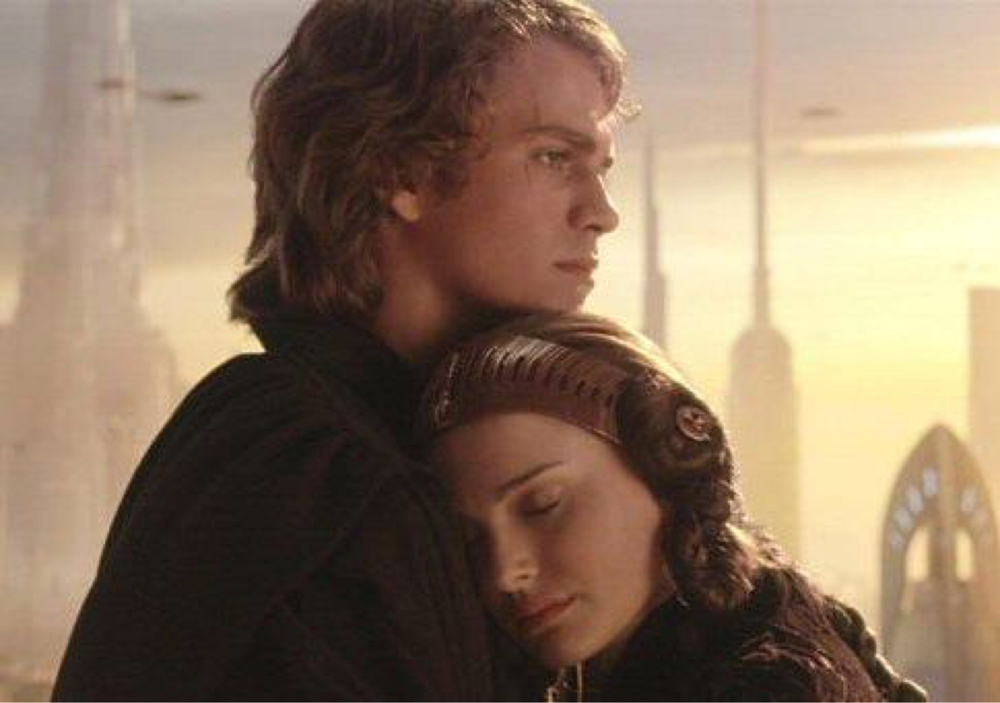

# Туторил для работы с языком разметки Markdown

## Заголовки

## Изображения

Картинка без `alt` текста

Картинка с альтом и тайтлом:

Картинка без `alt` текста

Запомнить просто: синтаксис как у ссылок, только перед открывающей квадратной скобкой ставится восклицательный знак.

Картинки «сноски»:

![Картинка][image1]
![Картинка][image2]
![Картинка][image3]

[image1]: joel.jpg
[image2]: original.png
[image3]: post.jpg

Картинки-ссылки:

## Исходный код

## Цитаты

## Таблицы